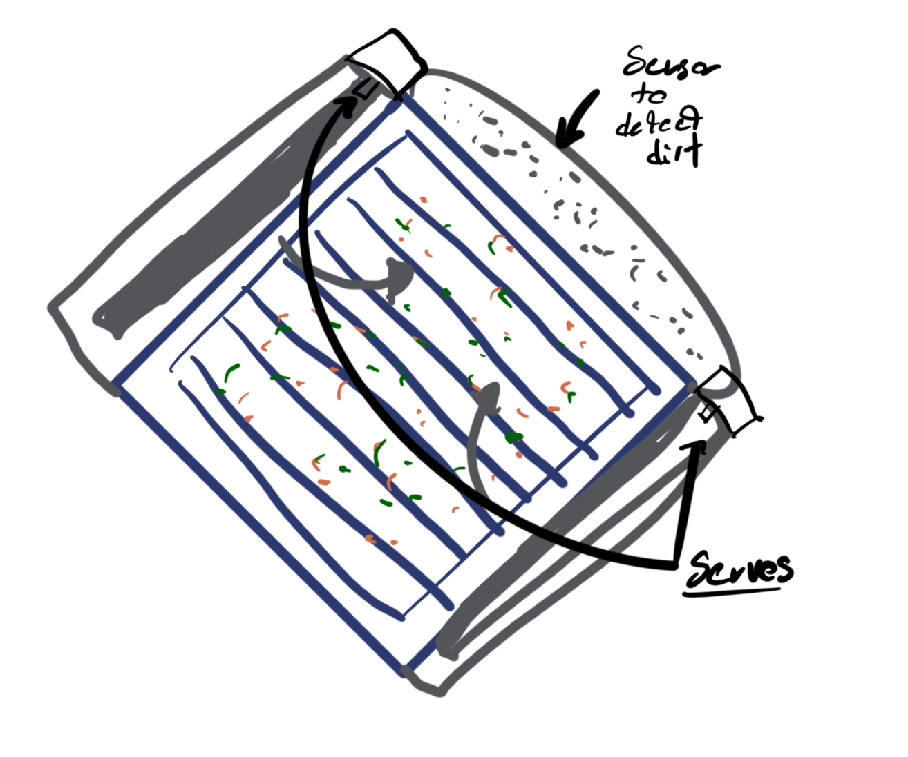
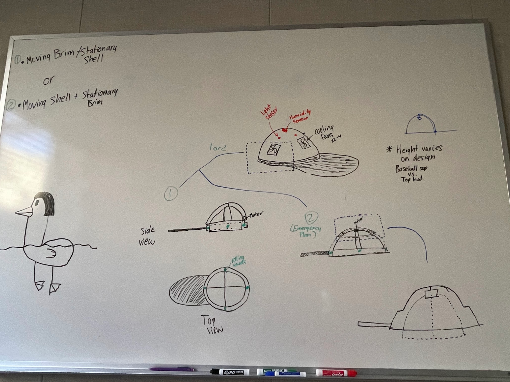

# Cool Cap Project

## Ideation Concepts
After our brainstorming session, our team set out to create some different project concepts. Putting together the brainstormed ideas into more cohesive product ideas, our team came up with three designs. 

### Concept 1: Humidity/Light Flower Helper

Description of Concept 1:  
- Detects humidity and temp of dirt
- Also detects sunlight and heat
- Sends signal to owners phone let them know if the water levels are low or if its not getting enough sun

---

### Concept 2: Solar Panel Cleaner

Description of Concept 2:  
- Detects dirt and other particles on solar panel
- Uses wiper blade like items to clean panel
- Two servo motors operate the wiper blades

---

### Concept 3: Cool Hat

Description of Concept 3:  
- Detects Light in different directions
- Built-in cooling fans 
- Humidity sensors included to activate fans when needed.
- Light sensors determine where to move the hat brim to ensure shade in that direction

All three designs held promise. In the end, our team chose to do the cool hat idea becuase it seemed like the project that could generate the most interesting final product and the one that would be the most rewarding and enjoyable to pull off. 
